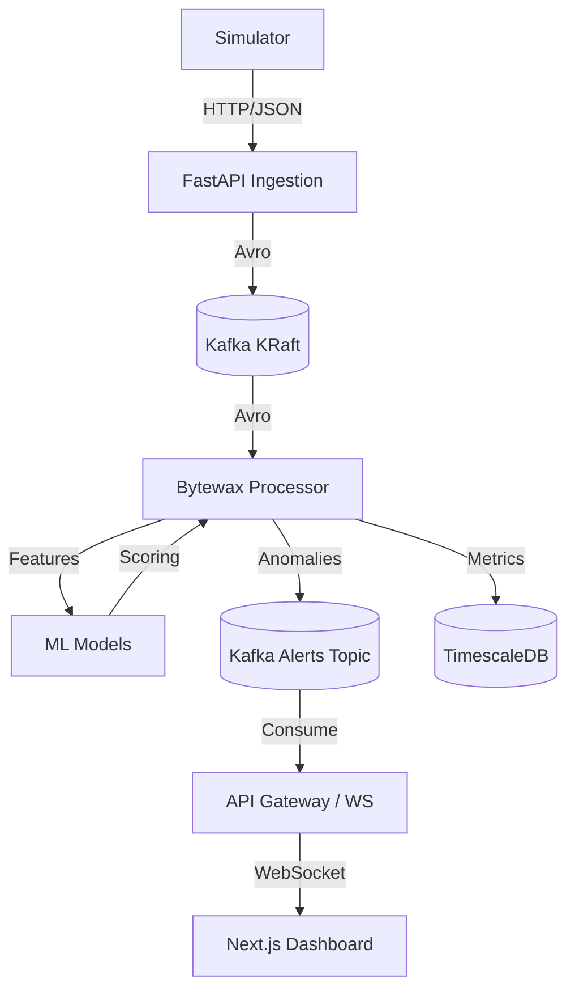

# Argus Architecture

This document describes the high-level architecture of Argus.

## System Overview

Argus is designed as a distributed, microservices-based system to handle high-throughput event ingestion, real-time stream processing, machine learning anomaly detection, and low-latency frontend visualization.

## Core Components

### 1. Data Ingestion (FastAPI)
The ingestion layer is built on FastAPI for asynchronous, high-throughput HTTP handling. 
- **Validation**: Strict Pydantic models for request validation.
- **Serialization**: Confluent Schema Registry integration to serialize JSON payloads into compact Avro binaries before sending to Kafka.
- **Rate Limiting**: Redis-based sliding window rate limiter.

### 2. Message Broker (Kafka in KRaft mode)
Apache Kafka acts as the central nervous system of Argus. It is deployed in KRaft mode (removing the ZooKeeper dependency) for simplified management and faster controller failovers.
- **Topics**: `sensor-readings` (high volume, partitioned), `alert-events` (compacted).

### 3. Stream Processing (Bytewax)
Bytewax is used for Python-native, stateful stream processing.
- **Windowing**: Tumbling and sliding windows aggregate sensor data (e.g., 10-second means, std devs).
- **ML Integration**: The aggregated features are passed in real-time to the ML models for inference.

### 4. Machine Learning
- **Isolation Forest**: Scikit-Learn based unsupervised anomaly detection for quick, multivariable outlier detection.
- **LSTM Autoencoder**: TensorFlow-based sequential model to detect anomalies based on reconstruction errors in time-series patterns.

### 5. API Gateway & Real-Time Feed
A secondary FastAPI service that consumes from Kafka/Redis and broadcasts events to connected clients via WebSockets, enabling sub-100ms UI updates.

### 6. Frontend Dashboard
A Next.js 14 App Router application.
- **State**: Zustand for global state management.
- **Visualizations**: D3.js for high-performance, 60fps streaming charts that don't block the React render cycle.
- **Styling**: Tailwind CSS with Glassmorphism aesthetic.
