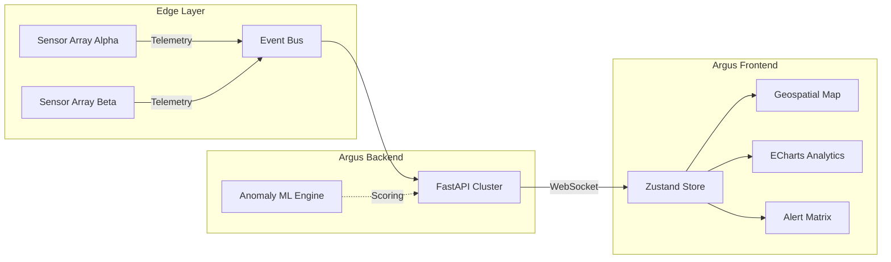

<div align="center">
  <h1>👁️ ARGUS</h1>
  <p><b>Enterprise Real-Time Anomaly Detection & Sensor Telemetry Platform</b></p>
  
  <p>
    <a href="https://argus-template.vercel.app"></a>
    
    
    
    
  </p>
</div>

---

## ⚡ Overview

**Argus** is a highly scalable, real-time telemetry dashboard designed for monitoring massive arrays of factory floor sensors. It leverages high-performance WebSockets to ingest thousands of messages per second, instantly processing anomaly detection algorithms to highlight critical failures before they cascade.

Argus brings dark-mode cyberpunk aesthetics into the enterprise domain without sacrificing usability or data clarity.

## 🚀 Key Features

- **🔴 Real-time Anomaly Detection:** Machine learning thresholds process incoming streams and instantly categorize anomalies by severity (Critical, High, Medium, Low).
- **🗺️ Geospatial Topological Mapping:** A 2D overlay of the factory floor (`Sector Beta-4`) that actively pulses when localized anomalies occur.
- **📊 Advanced Analytics:** ECharts integrations for real-time throughput tracking (messages/sec) and zonal anomaly distributions.
- **⚙️ Global State Persistence:** `Zustand` state management keeps your customized settings (Simulator Speed, Tolerance Thresholds) alive across sessions.
- **⚡ Zero-Latency WebSockets:** Powered by a backend `FastAPI` Python cluster capable of blasting mock or real sensor data seamlessly.

## 🏗️ Architecture



## 🛠️ Tech Stack

### Frontend Core
- **Next.js 16 (App Router)** - React Framework
- **Tailwind CSS v4** - Styling & Animations
- **Zustand** - Global State Management
- **ECharts (echarts-for-react)** - Heavy Data Visualization
- **Lucide React** - Iconography

### Backend Core
- **Python 3** - Runtime
- **FastAPI** - High performance WebSocket server

## 🏁 Getting Started

### 1. Start the Backend Simulation

```bash
cd backend
# Create a virtual environment (optional but recommended)
python -m venv venv
source venv/bin/activate  # On Windows: venv\Scripts\activate

# Install dependencies
pip install -r requirements.txt

# Run the WebSocket Server
python server.py
```
*The backend will automatically start broadcasting at `ws://localhost:8000/ws`.*

### 2. Start the Frontend Application

```bash
cd frontend

# Install dependencies
npm install

# Start the Next.js development server
npm run dev
```
*Open [http://localhost:3005](http://localhost:3005) in your browser to see the dashboard.*

## 🎨 Configuration

Settings can be dynamically adjusted in the **Settings (/settings)** tab:
- **Simulator Speed:** Controls the volume of mock data emitted if running in completely local frontend simulation mode.
- **Anomaly Threshold:** Sets the strictness of the ML alert bounds. Lower values flag more data points as critical anomalies.
- **Backend Connection:** Directly override the target WebSocket URL if running the Python cluster on a remote server.

## 📜 License
MIT License. See `LICENSE` for more information.
